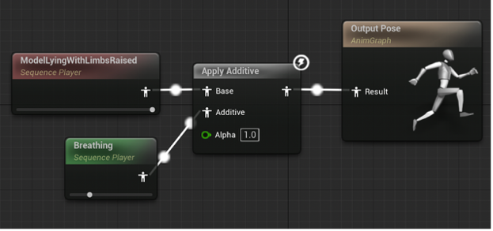
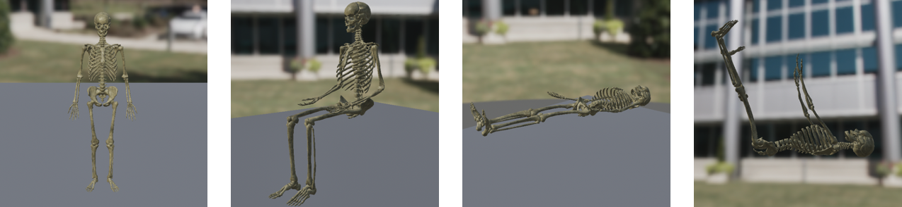

# Body positions

## Introduction

The body positions feature has been being developed to expand the clinical realism of the Virtual Anatomy application and improve the learning experience for nursing students
by enabling the 3D human model to be displayed in various medically relevant poses. These include common patient positions such as:

- standing, 
- sitting, 
- lying down, 
- lying down with raised limbs. 

Incorporating these postures would, as mentioned, enhance the educational value of the application by allowing users 
to observe and interact with the human body in contexts that reflect real-world medical scenarios.

One of the primary challenges in implementing this feature was to ensure that each body pose could be displayed accurately 
without interrupting the continuous breathing animation already integrated into the model. The solution required a method that supported both static positioning 
and additive animation blending, maintaining a natural appearance while minimizing performance overhead and animation artifacts.

Initial development focused on exploring whether skeletal mesh manipulation could serve as a foundation for pose switching. 
However, this approach proved to be inefficient and inflexible. It complicated the animation workflow and introduced difficulties in preserving consistency across poses. 

## How poses are created?

After some consultation with TU Delft's New Media Center, the focus shifted toward working directly with animations rather than skeletal structures. 
The adopted approach centers on creating individual Animation Sequences for each desired pose using the base skeletal mesh. These sequences capture the exact transformations needed to simulate each position. 
To preserve the breathing animation while applying new body poses, the Animation Blueprint system in Unreal Engine is used in combination with the “Apply Additive” node. This technique allows the base pose animation to remain static while layering the breathing motion additively on top of it.

<figure markdown="span">
  
    <figcaption>"Apply Additive" function application (from one of the desired body poses)</figcaption>
</figure>

This method proved both efficient and flexible. By treating each pose as a separate Animation Sequence and using the Apply Additive function, it became possible to dynamically blend static and dynamic animations. 
This approach not only preserves the integrity of the breathing animation but also enables smooth transitions between different body states.

## Current status and Future plans

After confirming the effectiveness of this setup, several poses were tried to be implemented as individual Animation Sequences and integrated into the Simulation Manager system. 
The groundwork was laid for extending this functionality further, with the potential to dynamically switch poses during simulation and adapt other systems - such as blood flow and organs alignment.

However, due to time constraints and competing other academic tasks, full implementation of the feature could not be completed within the development timeframe (namely, 2nd semester of 2024/2025). 
Nonetheless, the core animation system, including the additive blending of breathing and pose sequences, has been successfully prototyped. 
This foundational work could enable future developers (maybe it can be you who is going to fully implement this feature ;) ) to build upon a flexible and extensible system for representing human body positions within the Virtual Anatomy application.

To summarize, future plans for this feature and thus future tasks include:

- adjusting the behavior of blood flow simulations based on the body’s posture (for example, changes in circulation while lying down or sitting), 
- ensuring anatomical accuracy of internal organs in each position, 
- enabling real-time pose switching via Simulation Manager to reflect many clinical scenarios.