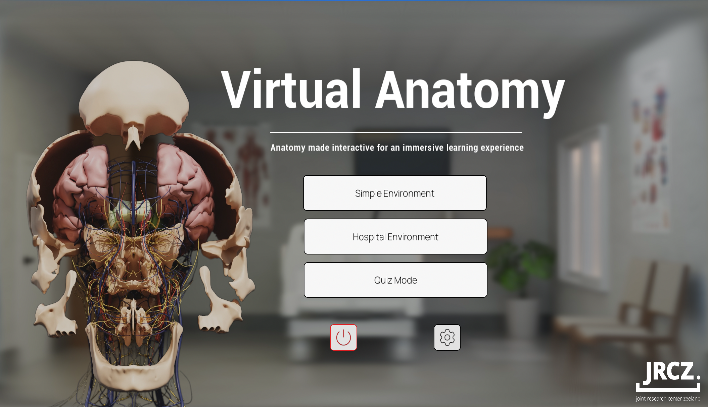
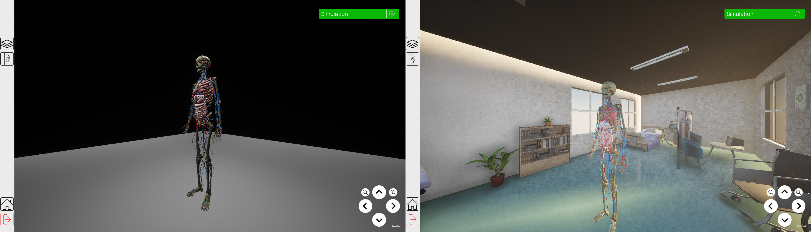
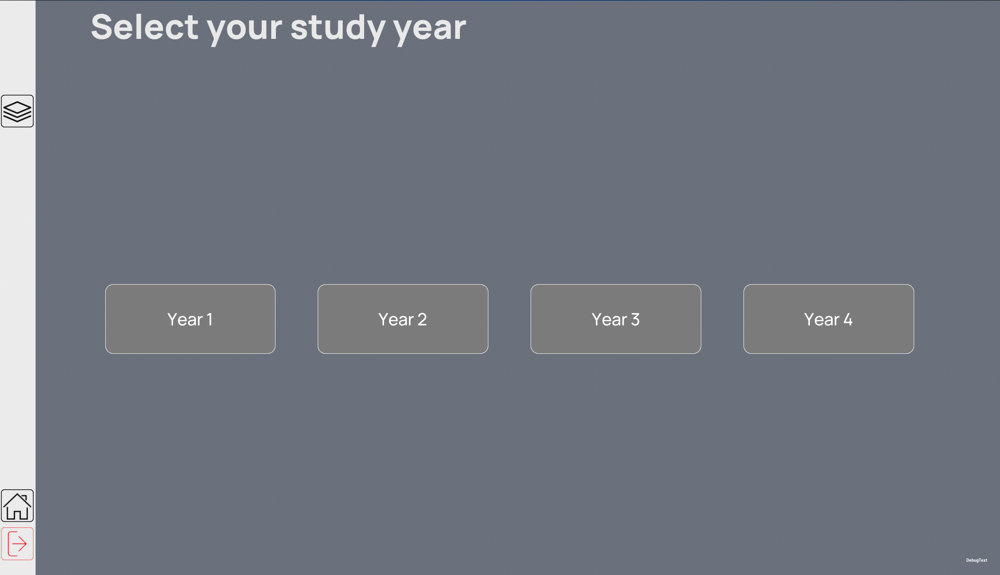

# First glance at the project

When you open this Unreal Engine project for the first time, you will see a lot of things and thus could feel overwhelmed. Let us break it down into smaller pieces so that you can understand what is going on.

## Content browser

On the very bottom of the Unreal Engine, you should see an icon with a folder; this is called the `Content Browser`. Here, all the project files, assets, and Blueprints for the Virtual Anatomy application are located.

!!! Warning
    TO BE ADDED: Content browser screenshot

For explanation of directories and files in the content browser, please refer to the separate [Content browser](ContentBrowser.md) page.

## Main menu level

The main menu level is the first thing you will see when you `Play` the project (run and test it directly in the editor). It is a very simple level with UI elements and a few buttons that allow you to navigate to different parts of the project namely, Explorer levels (in simple and hospital environment), Quiz level or Settings menu.

For deeper explanation of the Main menu level components/logic, please refer to the separate [Main menu level](Main-Menu-Level.md) page.

## Explorer level

The explorer level is a set of levels where you can explore the human body and interact with the different elements. The set consists of Simple environment and Hospital environment. You can access one of them by clicking on the "Simple environment" or "Hospital environment" buttons in the main menu.

For deeper explanation of the Explorer level components/logic, please refer to the separate Explorer level (hospital and simple environment) section.

## Quiz

The quiz level is a simple level that allows you to test your knowledge of the human body. You can access the quiz level by clicking on the "Quiz mode" button in the main menu.

For deeper explanation of the Quiz level components/logic, please refer to the separate Quiz section.

## Localization

The localization feature allows you to change the language of the project. You can access the localization settings by clicking on the "Settings" button in the main menu and then selecting "Localization". Currently, the project supports English and Dutch languages.

For deeper explanation of the Localization, please refer to the separate [Localization](Localization.md) page.
