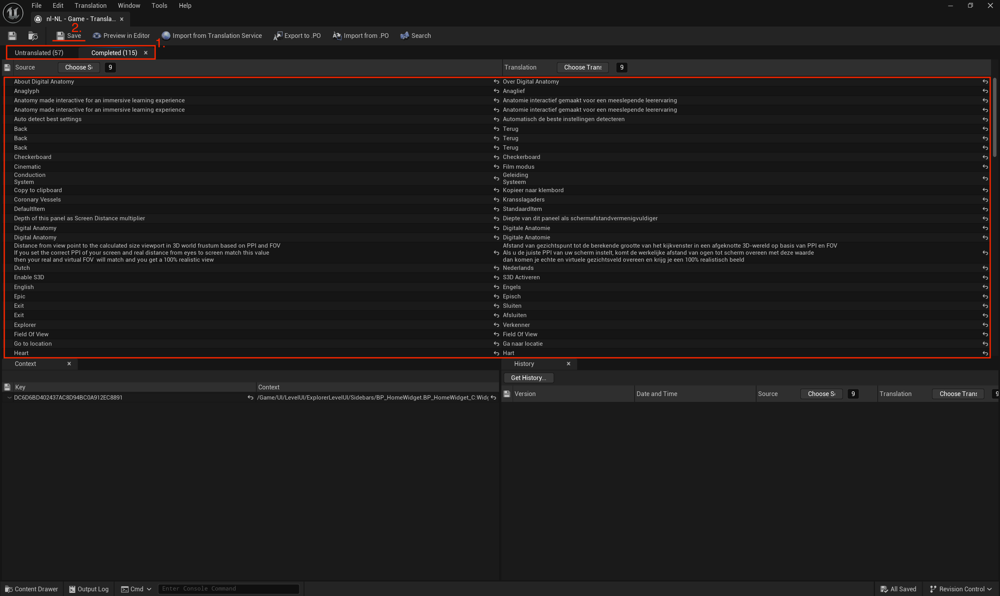

# Localization

The localization feature of the application was done through Unreal Engine's integrated localization. This section provides a step-by-step guide on how to update localization when needed.

## Adding new text for localization

### Text within Blueprint

First and foremost, for all (new) text blocks you want to translate, you need to specify if they should be localized. To do this, open your Widget Blueprint and switch to `Designer` mode [1.] (or any Unreal Engine object, like Data Table, containing a text field). Select any text block that you want to localize [2.]. Then, in the `Details` panel, click a flag icon [3.] make sure the `Localize` option is checked [4.].


Enabling this ensures that the text will be included when gathering content for translation.

### Text within C++ code

For text blocks that are defined in C++ code, you need to use the `LOCTEXT` or `NSLOCTEXT` macro. These macro allow you to define a text block that can be localized. Here is an example of how to use `NSLOCTEXT`:

```cpp
NSLOCTEXT([Namespace], [Key], [Source String]);
e.g. NSLOCTEXT("SomeNamespace", "SomeKey", "This is the text to be localized");
```

The only difference between `NSLOCTEXT` and `LOCTEXT` is that the former allows you to specify a namespace, which might help organize your localization strings better.

!!! Warning

    Make sure not to assign those macros to string variables since that would prevent the Unreal Engine from recognizing them as localizable text. They should be used/reffered in a `FText` variable.

## Localization configuration and modification

If you are ready to start localizing your application, you can do so through the `Localization Dashboard` which can be found in the `Tools` top menu. This dashboard provides a comprehensive interface for managing localization settings, gathering text, and translating content.

The process starts by gathering all the text used throughout the application. To do this, you need to keep the `Gather from Packages` and `Gather from Text Files` options enabled [0.1.] and tell the engine where to look for translation content. In case of packages, we used path wildcards to search everything inside the `Content` folder [0.2.], which holds all the files for the application. In case of Text Files, we applied the wildcard that searches for `.cpp` and `.h` files within the whole project (that includes `Source` directory containing C++ code) [0.3.].
(feel free, of course, to change/add any paths to your specific needs)

Next, you can add language(s) you want to support [1.]. Make sure that a 'native' language is English [2.]. Once that is done, click the `Gather Text` button [3.] to collect all the text for translation.

The next step is to actually translate the text we need. For this we open the `Translation editor` [4.] through the `Actions` segment of the cultures (First small icon, starting from left, below `Actions`).


Later, in the translation editor we simply translate the words we need manually. Watch out on `Untranslated`/`Completed` tabs [1.] and do not forget about the `Save` button [2.] to save your changes.



!!! Note

    It is possible to use third party services to translate, using `Portable Object` files. As these third party services are usually paid we refrained from using them, considering the scale of the application.

## Changing the language in the application

The change of the language in the application can be done through interaction with `WB_SettingsPage` (or simply Settings page).

Also, all behaviour and code logic inside `WB_SettingsPage` is implemented using Blueprints. In order to see the Blueprint functions, you need to go to switch from `Design` to `Graph` mode in the Widget Blueprint editor.

For switching between languages (English and Dutch), we use dispatchers for the buttons since they are reusable, then we  set the preferred culture using the `Set Current Culture` node where we specify the culture.

(The `Set Dot Visible` node is for UI purposes and casting to `CPP_GameInstance` and the `SaveCultureSetting` function are for saving the application state feature - it is a different topic).


To make sure we are getting the correct specification of the culture, we can check it by hovering over the cultures in the Localization Dashboard:


(though by default `en` is English, `nl-NL` is Dutch)

